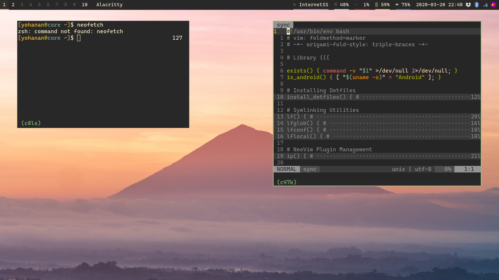

# YohananDiamond's Dotfiles

This repository contain my config for many programs, like bash, zsh,
neovim, tmux, termux etc.

It also has configuration for my Arch Linux environment - Xorg, bspwm,
sxhkd etc.

## Folder structure

- `config`: config files, mostly stored in `~/.config` and the hidden
  ones in `~`;

- `local`: contains directories that have their files symlinked to
  `~/.local/<dirname>`;

## Trying it out

While this is open for everyone to access, I don't recommend simply
copying these files. I believe it's better for you to only get what you
need from these files and slowly add what you *want* and *understand* to
your own setup.

I'd like you can freely use the `./sync` in the repo's root to do the
thing, but it's still pretty incomplete and I can't assure backups will
work well...

## Inspirations

- https://github.com/denysdovhan/dotfiles
- https://github.com/LukeSmithxyz/voidrice
