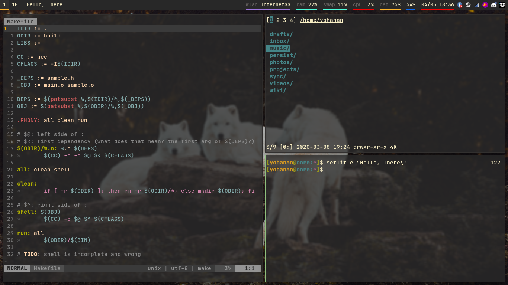

# YohananDiamond's Dotfiles

(Beware - I rarely update this screenshot image, so it might be
completely different right now.)

This repository contains most of my config files and scripts.

## Installation

This repo is very unstable. I really recommend taking a look only at
files that interest you instead of simply copying everything because not
only it is very unsafe due to most scripts here being pretty buggy, but
also because I believe it's better to only add to your system things
that you understand, instead of making it confusing with the imense
amount of bloat that would come with getting all scripts from a
repository.

If you want, you can clone the repo and use the `dotsync` in the
`scripts` folder to do the thing, but, as said before, it's very buggy,
and I can't even assure the backups feature will work well.

## Folder structure

* `config`: config files, mostly symlinked to `~` and `~/.config`;

* `desktop`: where some `.desktop` files are stored.

* `img`: some internal images (for example, the screenshot shown above);

* `trash`: old files that I don't want to delete right now, but aren't
  being used in the repo;

* `scripts`: executable files, symlinked to `~/.local/bin`

* `lib`: some personal libraries, symlinked to `~/.local/lib`. One
  example is `ystd.sh`, a personal library that many of my scripts use.

* `patches`: some patches I usually would like to apply on a system. I
  currently have no way to automate this.

## Inspirations and "Steals"

The repos below are the ones from where I remember ~~stealing code~~
taking inspiration to make my dotfiles. There are lots of more people
from where I took inspiration - specially from r/unixporn and r/vim -
and I can't possibly remember them all, but I'd like to thank them. It
has been a pretty cool experience to make, well, pretty much my own
operating system, even though I didn't code the Linux kernel or
something.

* https://github.com/denysdovhan/dotfiles
* https://github.com/LukeSmithxyz/voidrice
* https://github.com/jdhao/nvim-config
* https://bitbucket.org/sjl/dotfiles/src/tip/vim/vimrc

## To Do

* [ ] Maybe remove the `desktop` folder (as the time passes, I'm using it
  less and less);

* [ ] Find a license to put here;
